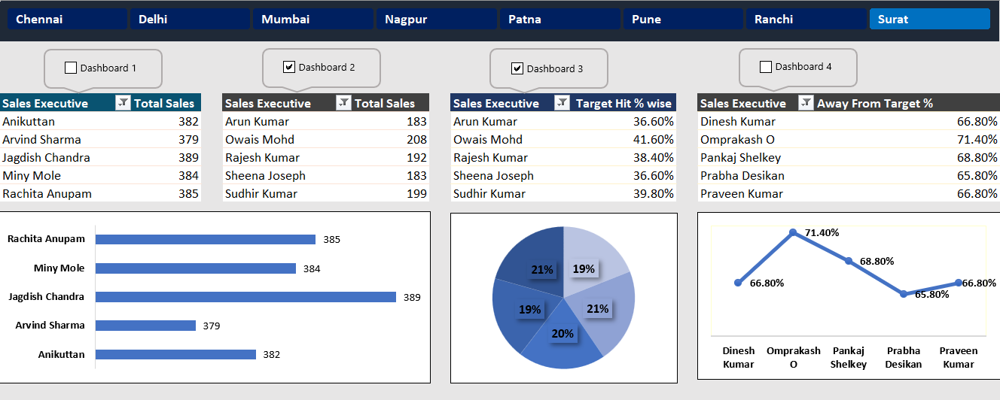

# 📊 Sales Performance & Logistics Analysis Dashboard (Excel)

## 📌 Project Overview
This data analytics project features an interactive and dynamic **Sales & Logistics Dashboard** built entirely in **Microsoft Excel**. The project processes transactional records to monitor monthly revenue trends, product category breakdowns, regional market shares, and key supply chain distribution metrics. 

The goal is to deliver actionable business insights that help management optimize shipping channels, track regional sales growth, and evaluate category-level profit margins.

---

## 🛠️ Advanced Excel Features & Techniques Used

* **Automated Dashboard Navigation (VBA & Macros):** Integrated custom Macro-driven interactive buttons (Dashboard 1, Dashboard 2, etc.). Clicking these custom controls triggers automated background routines that dynamically adjust chart types, view preferences, and layout matrices instantly.
* **Interactive Slicers & Timelines:** Connected synchronized multi-functional slicers for seamless, real-time cross-filtering across dynamic product categories, delivery status, and customer segments.
* **Advanced Visualizations & Charting:** Designed comprehensive Clustered Column charts, Line charts with trends, and Donut/Pie charts for proportional distributions.
* **Pivot Tables & Executive KPI Cards:** Built robust backend Pivot Tables to handle massive data aggregations and engineered clean top-level KPI metric summary cards for executive reporting.

---

## 📂 Dashboard Interface & Preview
Here is the full interactive interface designed in Excel:

---

## 🔍 Key Business Insights Extracted

The dashboard effectively delivers answers to critical operational performance metrics:

### 1. Sales & Revenue Trends
* **Monthly Peak Performance:** Tracks month-on-month trend directions to pinpoint exact seasonal revenue spikes.
* **Category Dominance:** Breaks down performance across main categories like Technology, Furniture, and Office Supplies to evaluate top margin drivers.

### 2. Logistics & Supply Chain Efficiency
* **Order Status Monitoring:** Monitors fulfillment rates by separating delivered orders from returned or in-transit shipments.
* **Ship Mode Breakdown:** Analyzes the proportion of logistics modes (Standard Class, Second Class, First Class, Same Day) utilized to check cost vs. speed efficiency.

### 3. Geographical Market Share
* **Regional Performance:** Compares market distribution across Central, East, South, and West regions to spot geographic growth opportunities.

---

## 🚀 How to Review This Project
1. Click on the **`Interactive_Dashboard.xlsm`** file in the list above. *(Note: Ensure your file extension is .xlsm or .xlsx as uploaded).*
2. Click the **Download** button to save the workbook to your local machine.
3. Open the file in Microsoft Excel and **MUST click "Enable Editing" and "Enable Macros/Content"** at the top bar.
4. Interact with the **Dashboard 1, Dashboard 2** buttons and slicers to experience the automated live chart transformations.
